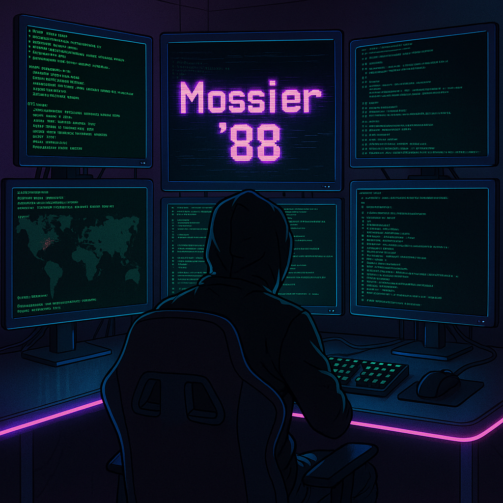

<!-- Mossier '88 Banner -->

  

<h1 align="center">Hi, I'm V.J.Joshi 👋</h1>

  <b>Cybersecurity Enthusiast | Certified Cybersecurity Technician 🛡️</b> 
  <i>Driven by curiosity, fueled by code, and obsessed with digital defense.</i>

---

### 🧠 About Me

🔍 I'm a cybersecurity practitioner passionate about understanding the adversary’s mindset. I specialize in identifying vulnerabilities, building secure systems, and automating security tasks using Python and other tools. My projects often explore OSINT, penetration testing, and malware triage.

🚀 Currently focusing on:
- Network security and packet analysis
- Threat intelligence and malware research
- Building ethical hacking tools and CTF challenges
- Staying sharp with hands-on labs and write-ups

---

### 📡 Connect with Me

  
  &nbsp;&nbsp;&nbsp;
  

---

### 📊 GitHub Stats

  

  

