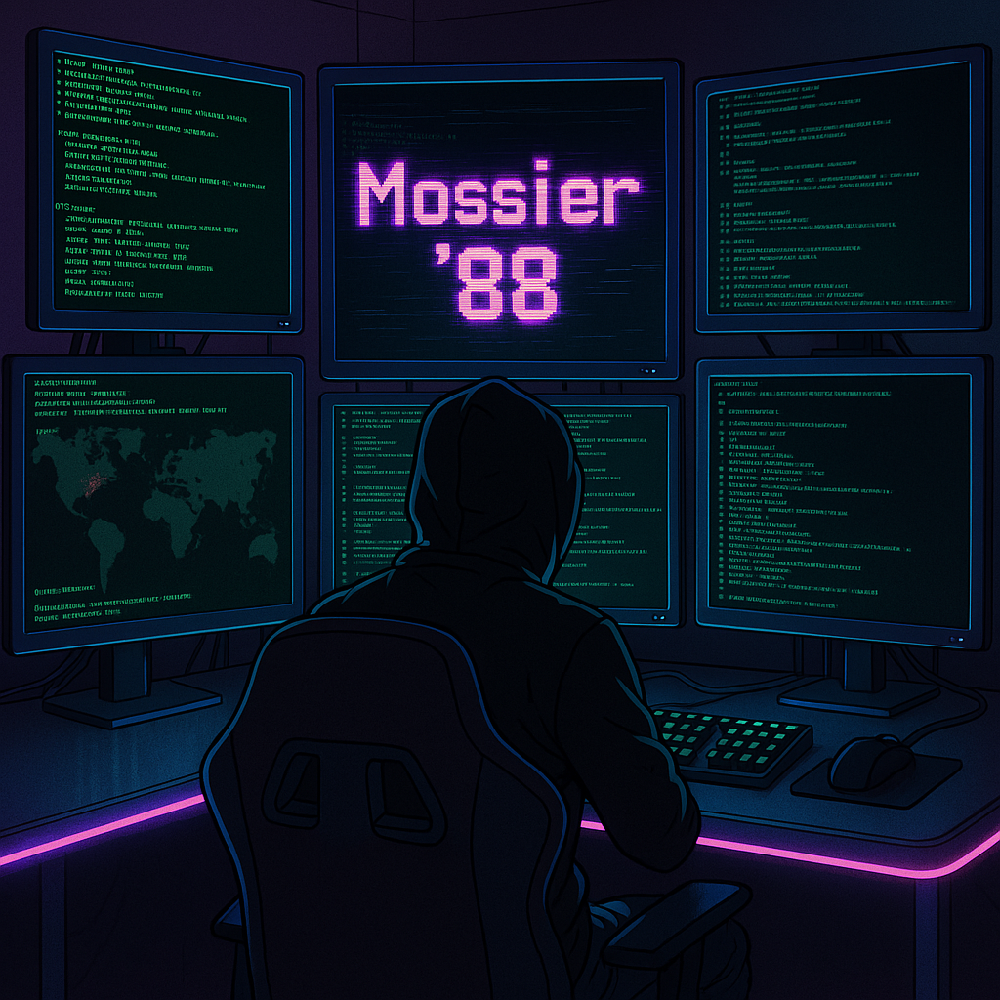

<!-- Mossier '88 Banner -->

  

<h1 align="center">Hi, I'm V.J.Joshi 👋</h1>

  <b>Cybersecurity Enthusiast | Certified Cybersecurity Technician 🛡️</b> 
  <i>Driven by curiosity, fueled by code, and obsessed with digital defense.</i>

---

### 🧠 About Me

🔍 I'm a cybersecurity practitioner passionate about understanding the adversary’s mindset. I specialize in identifying vulnerabilities, building secure systems, and automating security tasks using Python and other tools. My projects often explore OSINT, penetration testing, and malware triage.

🚀 Currently focusing on:
- Network security and packet analysis
- Threat intelligence and malware research
- Building ethical hacking tools and CTF challenges
- Staying sharp with hands-on labs and write-ups

---

### 🛠️ My Toolkit

  <!-- Row 1 -->
  
  &nbsp;&nbsp;
  Digital Forensics
  &nbsp;&nbsp;&nbsp;&nbsp;&nbsp;
  
  &nbsp;&nbsp;
  Network Penetration Testing
    
  <!-- Row 2 -->
  
  &nbsp;&nbsp;
  Mobile Application Penetration Testing
  &nbsp;&nbsp;&nbsp;&nbsp;&nbsp;
  
  &nbsp;&nbsp;
  Web Application Penetration Testing
    
  <!-- Row 3 -->
  
  &nbsp;&nbsp;
  Cloud Penetration Testing
  &nbsp;&nbsp;&nbsp;&nbsp;&nbsp;
  
  &nbsp;&nbsp;
  API Penetration Testing
    
  <!-- Row 4 -->
  
  &nbsp;&nbsp;
  Source Code Review
  &nbsp;&nbsp;&nbsp;&nbsp;&nbsp;
  
  &nbsp;&nbsp;
  VAPT
    
  <!-- Row 5 -->
  
  &nbsp;&nbsp;
  Red Team Operations
  &nbsp;&nbsp;&nbsp;&nbsp;&nbsp;
  
  &nbsp;&nbsp;
  Full-Stack Web Development
    
  <!-- Row 6 -->
  
  &nbsp;&nbsp;
  Cryptography
  &nbsp;&nbsp;&nbsp;&nbsp;&nbsp;
  
  &nbsp;&nbsp;
  Encryption

---

### 📂 Repository Overview

Below you'll find an overview of my most prominent projects and contributions:

- **[OSINT Tool Project](https://github.com/vishvam12a/Osinttool_project)**  
  A robust OSINT API for leaked username searches, designed with scalability and privacy in mind.
  
- **[Telepass](https://github.com/vishvam12a/Telepass.git)**  
  A secure Telegram-based password manager featuring 2048-bit RSA encryption and comprehensive key management.
  
- **[AWS Rekognition System](https://github.com/vishvam12a/image-and-video-rekognition-with-aws-main)**  
  An automated image and video analysis system utilizing AWS Rekognition and Python-based data workflows.
  
- **Other Projects:**  
  Check out my GitHub profile for more security-related repositories and contributions.

---

### 📡 Connect with Me

  
  &nbsp;&nbsp;&nbsp;
  
  &nbsp;&nbsp;&nbsp;
  

  <i>📞 +91 12345 67890</i> <!-- Replace with your actual number -->

---

### 📊 GitHub Stats

  

  

